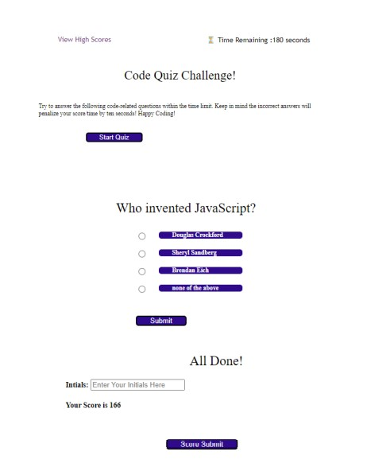

# Code Quiz  - Javascript - for Boot Camp Students

Authored by Charissa Hollister 05/04/2022

## Description
List notes and overall site features here 

## HTML
List notes and features here 

## CSS
List notes and features here 

## Script
List notes and features here 

## Website Access
### URL Live Webpage: 
### GitHub Repo:

## Future improvement opportunities
List them here 

### Minimum customer criteria
AS A coding boot camp student
I WANT to take a timed quiz on JavaScript fundamentals that stores high scores
SO THAT I can gauge my progress compared to my peers 

GIVEN I am taking a code quiz 
WHEN I click the start button 
THEN a timer starts and I am presented with a question 
WHEN I answer a question 
THEN I am presented with another question 
WHEN I answer a question incorrectly 
THEN time is subtracted from the clock 
WHEN all questions are answered or the timer reaches 0 
THEN the game is over 
WHEN the game is over 
THEN I can save my initials and score 
*********
In order to succeed in this challenge, you’ll apply the following skills: 
Create variables to store the quiz questions 
Use mouse-click events to start the quiz 
Write for loops to cycle through quiz questions 
Use key-press events to receive user input in the form of answers to quiz questions 
Create a time limit for the game using time functions 
Write conditional statements to determine wrong and right answers 
Use client-side storage to store high scores 
Use GitHub Pages to publish the page to the web 